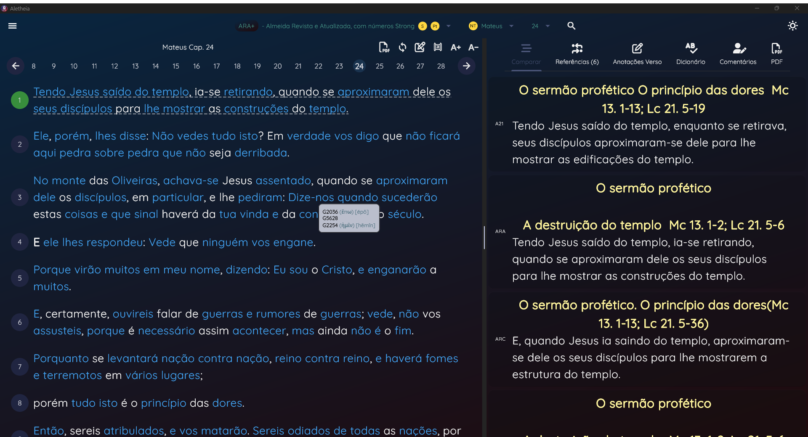

# Welcome Aletheia Project!

This Repository is a core for the ***Aletheia Project***.

Aletheia Project is a **Bible Study App** made in Flutter.
The goal of the project is to give a really userfull app that you can study the bible more precisely, the app include some of this feactures:

	 - Compore versions of the bible
	 - References of the verse
	 - Anotations of the verse
	 - Dictionary for words [related to the verse os not]
	 - Commentaries, linked to the chapter/verse
  	 - Lexico dictionary
	 - PDF printing
	 - PDF reading
	 - Import [not all]  database from myBible.zone app

The Core Model can be used to create a nice way to see the data.

The goal of the project is to deliver an app in any plataform. More especific the descktop or tablet plataform.

