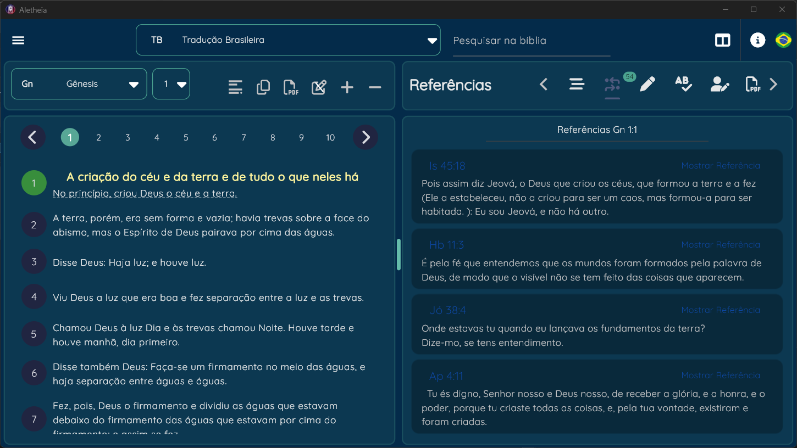

# Welcome Aletheia Project!

This Repository is for *core model* of the ****Aletheia Project**** [*private project yeat*] .

Aletheia Project is a **Bible Study App** made in Flutter.
The goal of the project is to give a really useful and easy to use app (shared in different platforms) that you can study the bible more precisely.

### The target of the project is ***Christian*** software that includes features to really delve into the word and be a platform for preachers/missionaries/students/teachers and people who are enthusiastic about the ***Word of God***.

## Download
Check the [***release***](https://github.com/rodolfogoulart/aletheia-core-model/releases) for the installer [*Windows*] [*MacOS*]

Check on [Microsoft Store](https://www.microsoft.com/store/productId/9NC9ZG5799G3?ocid=pdpshare) for oficial install and updates.

## Documentation
> [!NOTE]
> For personal Module creation, check the [Wiki](https://github.com/rodolfogoulart/aletheia-core-model/wiki), you can create modules, bible translations on another language.
> Please contact by creating a [Issue](https://github.com/rodolfogoulart/aletheia-core-model/issues) if you create a diferent module or for correction.

The app include some of this feactures:

	- Compore versions of the bible
	- References of the verse
	- Anotations of the verse
	- Dictionary for words [related to the verse os not]
	- Commentaries, linked to the chapter/verse
	- PDF printing
	- PDF reading
	- Import [not all]  database from myBible.zone app (Only DEV)
	- Lexico dictionary
	- Notes (Message, study, devocional, ...)
 	- Highlight on Verse and Words

The **Core Model** can be used to create a nice way to see the data and creating other applications integrated to the main app.

The goal of the project is to deliver an app in any plataform. More especific the desktop or tablet. 

## Initial Screen

## References from the verse

## User notes from the verse

## Dictionary words from the verse

## Commentary from the chapter/verse

## Lexico Word related to the version

## Some experiment with Chat-GPT [bible exegesis]

## Print pdf

## Goals
	- Import more data from myBible.zone
 	- Epub reading
  	- Database syncronization
   	- Internationalization
    	- release package
     	- responsible layout *just working for tablet and desktop now
