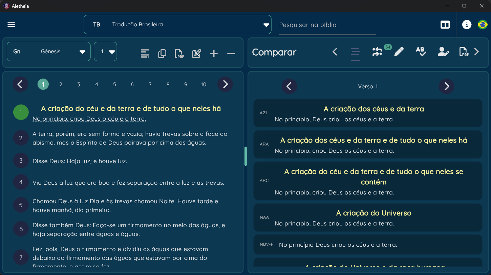
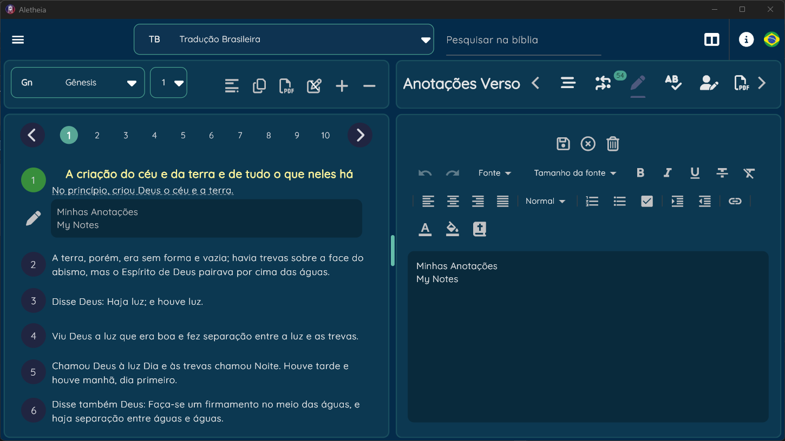
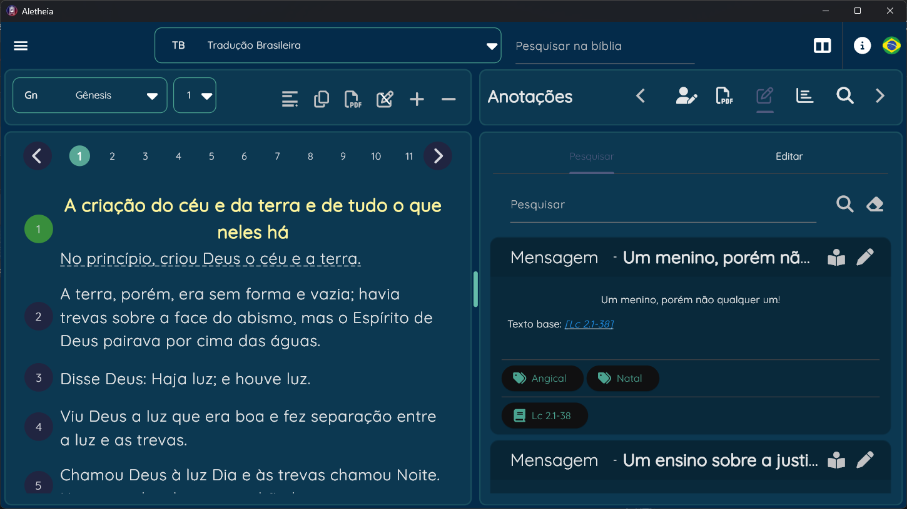

# Welcome Aletheia Project!
This Repository is for *core model* of the ****Aletheia Project**** [*private project yeat*] .

Aletheia Project is a **Bible Study App** made in Flutter.
The goal of the project is to give a really useful and easy to use app (shared in different platforms) that you can study the bible more precisely.

### The target of the project is ***Christian*** software that includes features to really delve into the word and be a platform for preachers/missionaries/students/teachers and people who are enthusiastic about the ***Word of God***.

## Download
Check on [Microsoft Store](https://www.microsoft.com/store/productId/9NC9ZG5799G3?ocid=pdpshare) for oficial install and updates.

Check the [Play Store](https://play.google.com/store/apps/details?id=com.i53.aletheia.bible) for the [*Tablet*] Android version

Check the [***release***](https://github.com/rodolfogoulart/aletheia-core-model/releases) for the installer [*Windows*] [*MacOS*] [*Linux*] (Out of date)

## Documentation
> [!NOTE]
> For personal Module creation, check the [Wiki](https://github.com/rodolfogoulart/aletheia-core-model/wiki), you can create modules, bible translations on another language.
> Please contact by creating a [Issue](https://github.com/rodolfogoulart/aletheia-core-model/issues) if you create a diferent module or for correction.
> The **Core Model** can be used to create a nice way to see the data and creating other applications integrated to the main app.
> *** **Important note: as the app is in full development, the database modules used on the app some times will be full replaced during updates, if you develop some type of module, it's important to keep a backup script of your own database or sql insert!!!**

## Feactures:
	- Compare versions of the bible
	- References of the verse
	- Personal Notes of the verse
	- Dictionary for words [related to the verse or not]
	- Commentaries, linked to the chapter/verse
	- PDF printing
	- PDF reading
	- Import [not all]  database from myBible.zone app (Only DEV)
	- Lexico dictionary
	- Personal Notes (Message, study, devocional, ...)
	- Bookmark the verse
 	- Highlight words on verse
	- Multiple readings (see side by side bible versions)
	- Search on the bible
	- Cross reference
	- Create your own pericope on the chapter
 	- Preaching Mode
  		- Open a window full size with the message and have easy acess to the references that was already filled

## Initial Screen

## References from the verse

## User notes from the verse

## Dictionary words from the verse

## Commentary from the chapter/verse

## Lexico Word related to the version

## Personal Notes

## Print pdf

## Search on bible

## Preaching Mode

## Multiple readings

## Personal pericope editor for the chapter

## Goals
The goal of the project is to deliver an app in any plataform. More especific the desktop and tablet.
* **Why just desktop and tablet?** *It's because the layout of the app. Mobile(celphone) has already some really good apps like `myBible` or `SwordBible` that has many feactures on it, but for desktop you will find hard to see some app, easy and acessible to use.*

List of some goals

	- Import more data from myBible.zone 	
	- Import data from ebible.org
  	- Database syncronization between devices
		- Add some way to download script
   	- Internationalization
		- PT-BR and EN for now
	- release 
     		- package on MAC OS (Store), 
       		- Android For Tablet (On BETA TEST ALREADY)
    - responsible layout *just working for tablet and desktop now
	- NLP
		- In Development
		- Add API to get the text nlp	
	- Improve search on bible
 		- Use of Text embedding to search text more acurraty
	- Videos of tutorial
	- Auto search for references on the notes and fill the form to use on `preaching mode`
