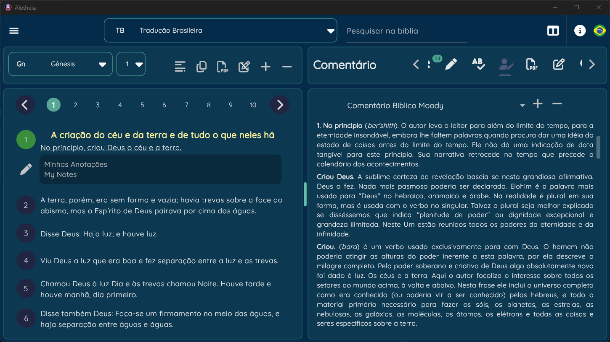
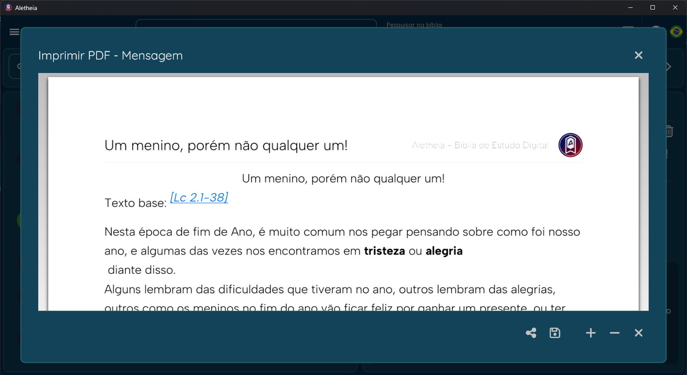

# Welcome Aletheia Project!

This Repository is for core model of the ****Aletheia Project**** [*private project yeat*] .

Aletheia Project is a **Bible Study App** made in Flutter.
The goal of the project is to give a really userfull app that you can study the bible more precisely, the app include some of this feactures:

	 - Compore versions of the bible
	 - References of the verse
	 - Anotations of the verse
	 - Dictionary for words [related to the verse os not]
	 - Commentaries, linked to the chapter/verse
	 - PDF printing
	 - PDF reading
	 - Import [not all]  database from myBible.zone app

The Core Model can be used to create a nice way to see the data.

The goal of the project is to deliver an app in any plataform. More especific the descktop or tablet plataform.

## Initial Screen

## References from the verse

## User notes from the verse

## Dictionary words from the verse

## Commentary from the chapter/verse

## Lexico Word

## Some experiment with Chat-GPT [biblica exegesis]

## Print pdf

## Goals
	- Import more data from myBible.zone
 	- Epub reading
  	- Database syncronization
   	- Internationalization, need to implement translation
    	- release package
     	- responsible layout *just working for tablet and descktop now
